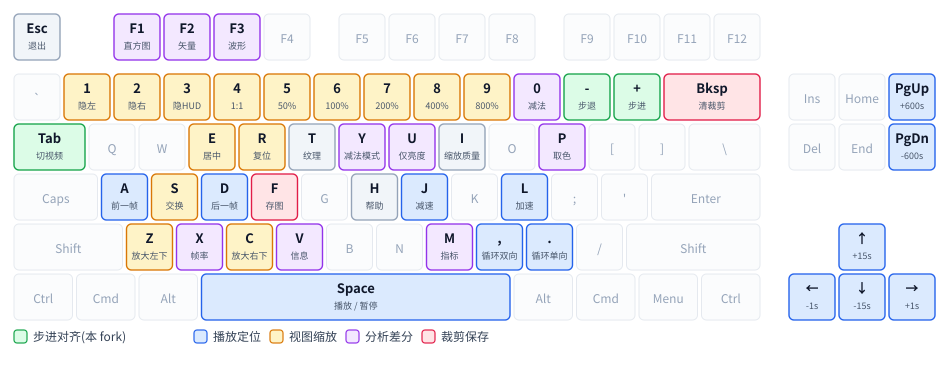

# video-compare 中文文档

并排比较两个(或多个)视频文件,可逐帧对齐、缩放、做差分。

本文档涵盖**使用方法**、**版本历史**和**已知问题**。完整的英文说明见 [README.md](README.md),
逐版本变更见 [CHANGELOG.md](CHANGELOG.md)。

这是 [pixop/video-compare](https://github.com/pixop/video-compare) 的 fork,在上游基础上增加了
**逐帧步进对齐**和**裁剪预览**两个功能。

---

## 安装

> **包管理器装的是上游 pixop 版,不含本 fork 的修复。**
> `brew install video-compare` / `yay -S video-compare` 都能跑,但**没有** v1.0~v1.2 的任何改动 ——
> 而且不会有任何提示。要本 fork 的版本,只能用下面的方式。

### macOS / Linux — 从源码编译

```sh
git clone https://github.com/powder21/video-compare.git
cd video-compare
git checkout v1.2
./install.sh
```

脚本会装缺失的依赖(已装的不动,即使来自别的 tap)、编译、安装到 `/opt/homebrew/bin`
或 `/usr/local/bin`。macOS 上它还会检查 SDL2 是否一致,不一致就自动修好 —— 见下。

<details>
<summary><b>install.sh 在 macOS 上多做的那件事:两个 SDL2</b></summary>

Homebrew 的 `sdl2` 现在是 `sdl2-compat`(SDL2-on-SDL3 垫片)的别名。若机器上还留着迁移前的旧
`sdl2`,主程序和 `libSDL2_ttf` 可能各链一个,**同一进程里载入两个 SDL2 实现**。
`--version` 不碰 SDL,照跑不误,所以这个状态不会自己暴露。

脚本以 **`libSDL2_ttf` 为准**(它是预编译的,改不动),把主程序 link 到同一个再重编。
全新机器上两边都是 `sdl2-compat`,一致,不会触发。

手动做的话:

```sh
P='/opt/homebrew/opt/sdl2[^/]*/lib/libSDL2-2\.0\.0\.dylib'
otool -L video-compare | grep -oE "$P"
otool -L "$(brew --prefix sdl2_ttf)/lib/libSDL2_ttf-2.0.0.dylib" | grep -oE "$P"
# 两条不同的话(下面的 <formula> 填 libSDL2_ttf 那条里的):
brew unlink sdl2 sdl2-compat; brew link --overwrite <formula>; make -B && make install
```

</details>

不想用脚本的话,`brew install ffmpeg sdl2 sdl2_ttf`(Linux 见 `install.sh` 里的
apt/dnf 命令)之后 `make -j4 && make install` 即可。

### 构建产物

[Actions](https://github.com/powder21/video-compare/actions) 页面每次提交都会产出三个平台的构建。

| 平台 | 可用性 |
|---|---|
| **Windows** | **✓ 解压即用** —— 自带全部 DLL |
| **macOS** | **△ 有限制** —— 自带依赖,但**仅 arm64**、且**只能在 macOS 26+ 运行**(产物不向下兼容 CI runner 的系统版本)。用前需 `xattr -dr com.apple.quarantine .` 清除下载隔离 |
| **Linux** | **✗ 不建议** —— 裸二进制,链接 CI runner 的系统库,换台机器多半跑不起来 |

Intel Mac、旧版 macOS、以及 Linux,请从源码编译。

---

## 快速上手

```sh
video-compare left.mp4 right.mp4              # 最常见的用法
video-compare a.mp4 b.mp4 c.mp4               # 一个左视频对多个右视频,Tab 切换
video-compare -w 1280x left.mp4 right.mp4     # 指定窗口宽度
video-compare -m vstack left.mp4 right.mp4    # 上下堆叠而非左右分割
```

启动后**左右移动鼠标**拖动分割线,**滚轮**缩放,**空格**播放/暂停。

---

## 键盘

### 主键盘区



> 图中只画**单键**功能,灰色键无单键功能。带修饰键的(`Shift+`、`Ctrl+`、`Alt+`)见下方表格。

### 播放与定位

| 按键 | 功能 |
|---|---|
| `Space` | 播放 / 暂停 |
| `←` `→` | 后退 / 前进 1 秒 |
| `↑` `↓` | 前进 / 后退 15 秒 |
| `PgUp` `PgDn` | 前进 / 后退 600 秒 |
| `J` `L` | 减速 / 加速播放 |
| `,` `.` | 缓冲区内循环播放(双向 / 单向) |
| `A` `D` | 在缓冲区内浏览上一帧 / 下一帧 |
| `Shift+A` | 跳到上一帧(帧内编码格式效果最佳) |
| `Shift+D` | 解码并前进一帧 |

### 逐帧对齐(本 fork 新增)

比较两个视频时,若右视频比左视频早/晚若干帧,用这组键把它们对齐。**偏移量会显示在屏幕上。**

| 按键 | 功能 |
|---|---|
| `+` `-` | 当前右视频前进 / 后退 **1 帧** |
| `Ctrl` + `+` `-` | 前进 / 后退 **10 帧** |
| `Alt` + `+` `-` | 前进 / 后退 **100 帧** |
| `Ctrl+0` | 清除当前右视频的偏移 |
| `Tab` | 切换到下一个右视频 |
| `Ctrl+Shift+1..0` | 直接切到第 1~10 个右视频 |

> 步进只在**暂停**时可用。屏幕上没有"当前是哪个右视频"的提示,可用 `Shift+X` 在终端确认。

### 视图

| 按键 | 功能 |
|---|---|
| `1` `2` `3` | 隐藏/显示 左视频 / 右视频 / HUD |
| `4` | 1:1 像素 |
| `5` `6` `7` `8` `9` | 缩放 50% / 100% / 200% / 400% / 800% |
| `Z` `C` | 放大鼠标周围区域(显示在左下角 / 右下角) |
| `E` | 以鼠标位置为中心重新居中 |
| `R` | 全局居中并复位缩放到 100% |
| `S` | 交换左右视频 |
| `O` | **闪烁对比**(本 fork 新增):只显示一侧、无滑条,`←`/`→` 来回翻;再按 `O` 退出 |
| `Shift+M` | 循环切换布局(分割 / 上下 / 左右) |
| `Shift+S` | 循环切换宽高比模式 |
| `Alt+Enter` | 全屏 |

> **闪烁对比(`O`)**:同一位置的画面来回闪变,人眼对这个远比"并排看两幅"敏感 ——
> 并排需要来回扫视,闪烁则直接把差异变成运动。找编码瑕疵比拖滑条灵敏得多。
>
> 模式内 `←`/`→` 翻面,`1`/`2` 直接点名要看哪一侧(模式内它们是"选择",不是平时的"隐藏切换" ——
> 否则会把仅有的一侧也关掉变黑屏)。其余按键照常:空格播放、`+`/`-` 步进对齐、缩放平移、
> `Tab` 换右视频都能用 —— 发现差异后通常正想立刻动手。
>
> 再按 `O` 退出,恢复进入前的显示状态。`Esc` 在任何模式下都是退出程序。

### 差分与分析

| 按键 | 功能 |
|---|---|
| `0` | 切换 视频 / 减法(差分)模式 |
| `Y` | 循环切换减法模式 |
| `U` | 仅亮度减法模式 |
| `M` | 在终端打印图像相似度指标 |
| `P` | 在终端打印鼠标位置和像素值 |
| `F1` `F2` `F3` | 直方图 / 矢量示波器 / 波形图 |
| `V` | 视频信息浮层 |
| `N` | **绝对帧号**(本 fork 新增,**默认开**) |
| `X` | 显示帧率(视频 / UI) |

> **左右上角的时间戳后面跟着 `#N`,默认就开**,`N` 键可关。那是该帧在**它自己文件里**的序号,
> 从 0 开始数,和 FFmpeg 的 `select='eq(n,150)'` 一致。两侧各按自己的时间线计数,
> 所以步进对齐后两个数字的差就是实际帧偏移。也跟随 HUD 开关(`3` 键)。
>
> 仅对**恒定帧率**准确。帧号用容器的精确帧率按**有理数**计算(不是先转成整数帧长再除
> —— 59.94fps 的帧长是 16683.33µs,取整会每两万多帧丢一帧)。实测 59.94 / 29.97 / 25 /
> 23.976 四种帧率各跑满一小时、约 50 万帧,**零误差**。
>
> VFR 下没有帧率可除,"第几帧"要索引整个文件才答得出来 —— 未实现,那种素材上显示 `#?`
> 或数字不可信。

### 裁剪与保存(本 fork 新增)

| 按键 | 功能 |
|---|---|
| `Shift+F` | **选区并打开裁剪预览**;预览中 `Enter` 只存拼接图,`Shift+Enter` 存左视频 + 每个右视频 + 拼接图 |
| `F` | 保存两侧当前帧和屏幕内容为 PNG |
| `Shift+L` `Shift+R` `Shift+B` | 交互式裁剪 左视频 / 右视频 / 两侧同区域 |
| `Backspace` | 清除裁剪 |

### 其他

| 按键 | 功能 |
|---|---|
| `H` | 显示/隐藏屏幕帮助 |
| `Esc` | 退出 |
| `I` `T` | 切换 输入对齐缩放质量 / 纹理过滤方式 |
| `Ctrl+C` / `Cmd+C` | 复制左视频当前时间戳 |
| `Ctrl+V` / `Cmd+V` | 粘贴时间戳并跳转 |
| `Shift+X` | 在终端打印内部状态(调试用) |
| `Shift+W` / `Ctrl+W` / `Ctrl+Shift+W` | 恢复保存的窗口尺寸 / 恢复启动尺寸 / 保存当前尺寸 |

> 按住 `Ctrl` 或 `Shift` 可让相对定位、播放速度、缩放的调整幅度更小。

---

## 鼠标

| 操作 | 功能 |
|---|---|
| 左右移动 | 拖动分割线 |
| 滚轮 | 以光标下的像素为中心缩放 |
| 按住右键拖动 | 平移画面 |
| 左键单击 | 按光标横向位置跳转(目标位置显示在右下角) |

> 单击跳转会落到最近的**关键帧**,不是精确帧。

---

## 常用命令行选项

完整列表见 `video-compare --help`。

| 选项 | 说明 |
|---|---|
| `-w, --window-size` | 窗口尺寸,如 `800x600`、`1280x`、`x480` |
| `-m, --mode` | 布局:`split`(默认)/ `vstack` / `hstack` |
| `-t, --time-shift` | 时移右视频,如 `0.150`、`-0.1`、`x1.04+0.1` |
| `-f, --frame-buffer-size` | 帧缓冲大小,默认 50(影响步退能走多远不用 seek) |
| `-S, --subtraction-mode` | 以差分模式启动 |
| `-u, --fullscreen` | 全屏启动 |
| `-d, --high-dpi` | 高 DPI 模式(Retina 上显示 HD 内容推荐) |
| `-b, --10-bpc` | 每通道 10 bit |
| `-a, --auto-loop-mode` | 缓冲满后自动循环:`off`(默认)/ `on` / `pp`(乒乓) |
| `-v, --verbose` | 详细输出(库版本、渲染细节等) |
| `-c, --show-controls` | 打印全部快捷键后退出 |

用 `::` 分隔符可为**单个右视频**覆盖任意选项,例如给第二个右视频单独指定解码器。

---

## 显示器设置与像素级比对(macOS)

> 只适用于 macOS 的 Retina / 缩放显示模式。Windows 和 Linux 的 DPI 机制不同,以下不适用。

比编码质量时,**画面被静默缩放过一次你是看不出来的** —— 而缩放正好抹掉你要找的高频细节。
在 4K 面板上想要像素对像素:

1. **显示器设为 1080p**(4K 面板上唯一零重采样的档位,见下)
2. **`alias vc='video-compare -d -u'`**
3. **打开后按一次 `4`**

对任意 **≤4K** 的视频都是像素对像素。视频小于面板时画面就是居中一小块,四周留空 —— 物理必然。

**自查**:`-v` 的输出里,`SDL GL drawable size` 小于 `Video size` 就说明画面被降采样了。

<details>
<summary><b>为什么是这样(4K 面板 + 2560×1440 视频的实测过程)</b></summary>

### 两个开关各管一半

| | 作用 |
|---|---|
| **`-d`** | 让 **drawable 像素 = 面板物理像素**(申请 2x 背景缓冲) |
| **按 `4`** | 让 **1 视频像素 = 1 drawable 像素** |

只加 `-d` 不按 `4`,视频仍被拉伸铺满窗口;只按 `4` 不加 `-d`,1:1 是相对逻辑像素的,面板上仍放大一倍。

### 为什么 1080p 档最好

macOS 对非原生档位是**按逻辑分辨率的 2 倍渲染,再重采样到面板**:

| 档位 | 帧缓冲 | → 面板 3840×2160 |
|---|---|---|
| **1080p** | 1920×1080 × 2 = **3840×2160** | **正好相等,零重采样** ✓ |
| 1440p | 2560×1440 × 2 = **5120×2880** | 超出面板,**降采样 ×0.75** ✗ |
| **4K 原生** | 3840×2160(1x) | 正好相等 ✓,但系统 UI 极小 |

**1080p 是 4K 面板上唯一"逻辑×2 正好等于面板"的档位。1440p 是唯一有损的** —— 很反直觉,
"更接近原生的设置"反而更差。换别的面板尺寸时按同一判据自己推即可。

> 帧缓冲到面板这一步 SDL 看不到,上表由实测的 `drawable ÷ 窗口` 倍率反推:1080p 和 1440p 档都报 2x,4K 原生报 1x。

### 实测矩阵

| 显示器 | `-d` | desktop | 窗口(点) | **drawable** | |
|---|---|---|---|---|---|
| 1080p | 无 | 1920×1080 | 1920×1018 | 1920×1018 | 缩到 75% |
| **1080p** | **有** | 1920×1080 | 1280×720 | **2560×1440** | **1:1 ✓** |
| **1080p** | **有 + `-u`** | 1920×1080 | 1920×1080 | **3840×2160** | 按 `4` 后 **1:1 ✓** |
| 1440p | 无 | 2560×1440 | 2560×1378 | 2560×1378 | 面板再降 ×0.75 |
| 1440p | 有 + `-u` | 2560×1440 | 2560×1440 | 5120×2880 | 面板再降 ×0.75 |
| 4K | 无 | 3840×2160 | 2560×1440 | 2560×1440 | 1:1 ✓(UI 极小) |
| 4K | 有 | 3840×2160 | 1280×720 | **1280×720** | **缩到 50%,最差** |

### 几个坑

**`-u` 只适合视频分辨率 ≥ 面板的情况。** 它强制 drawable = 全屏,2K 视频在 4K 面板上全屏会被放大 1.5 倍;
而默认是**最近邻**过滤(`Bilinear filtering: false`),非整数倍的最近邻放大会产生不均匀像素块,
**看起来很像编码瑕疵**。按 `4` 可消除。

**`-d` 在 1x 档位(4K 原生)帮倒忙** —— 见已知问题表 `display.cpp:296`。那一档要 1:1 就别加 `-d`。

**1440p 档不要用于画质评估**,窗口和全屏都有 ×0.75 降采样。

</details>

---

## 版本历史

### v1.3 — 2026-07-29

**两个新功能。**

- **帧号** —— HUD 时间戳后面跟 `#N`,从 0 开始数,和 FFmpeg 的 `select=` 一致。两侧各按自己的文件计数,
  所以两个数字的差就是步进造成的偏移。用容器帧率按有理数计算(不是先转整数帧长再除 ——
  59.94fps 的帧长是 16683.33µs,取整会每小时丢四帧)。仅 CFR 准确,`N` 可关。
- **闪烁对比** —— `O` 只显示一侧、占满整幅、无滑条,`←`/`→` 来回翻,再按 `O` 还原。
  并排看要来回扫视,闪烁则把差异直接变成运动,找编码瑕疵灵敏得多。模式内只接管方向键,
  播放、步进、缩放照常。
- **`install.sh`** —— 自动处理 Homebrew 的 `sdl2` → `sdl2-compat` 迁移导致的"一个进程里两个 SDL2"。
- **macOS 构建产物自带依赖**(此前是裸二进制,下载后无任何输出直接失败)。仍仅 arm64、且不向下兼容。

### v1.2 — 2026-07-17

**步进现在准了。**

- 步进超过约 8 帧后,两边可能**轮流播放**(一边动、另一边冻住,然后反过来)。原因是偏移量每帧都从帧时长的滑动均值重算,而这个均值又是从被偏移量移动过的时间戳测出来的 —— 它在喂自己。现在偏移在你按下按键的那一刻就固定成时间值,取自被跨过的帧之间的真实距离。
- 先步退再步进会**跳帧**,而且明明差了一帧却报告零偏移。被退过的帧现在会留着,步进时原样还回去,`+` 和 `-` 严格互逆。
- 步退越过视频开头不再记录不存在的帧数 —— 那会在恢复播放时把**左视频**往前拖。
- **屏幕上的偏移数字现在总是和画面一致**,不会再出现"两边对齐却显示 -1 帧"。
- 同一文件比较多次、且其中某个右视频被步进过时,播放中 seek 可能冻住窗口。
- 每个右视频现在按自己的帧率来对齐,而不是当前选中那个的。

### v1.1 — 2026-07-16

**步进不再冻死窗口,Windows 恢复可编译。**

- 步进右视频后恢复播放,或步进超出内存中的帧,窗口会冻死,只能强杀进程。只在同一文件互相比较时发生。
- MinGW 构建被钉死在一个依赖脚本已不再下载的 FFmpeg 版本上,导致每次 Windows 构建都失败。

### v1.0 — 2026-04-13

**两个新功能。**

**逐帧步进** — 用 `+` / `-` 相对左视频步进当前右视频(`Ctrl` 十帧,`Alt` 百帧),偏移量显示在屏幕上,`Ctrl+0` 清除。

**裁剪预览** — `Shift+F` 选区后打开预览而非直接保存。可绕光标缩放、平移,`Enter` 存拼接图,`Shift+Enter` 存左视频 + 每个右视频 + 拼接图。保存前用原生对话框选目录,文件名带时间戳前缀。

---

## 已知问题

以下是代码审查发现、经复现或推演确认,但**有意未修**的问题。每条都注明了原因 ——
它们要么现实中概率极低,要么改了也无法通过运行程序验证。本 fork 的原则是:**验证不了的就不改。**

行号会随改动漂移,括号里的函数名才是稳定的检索依据。

| 位置 | 问题 | 为什么还留着 |
|---|---|---|
| `video_compare.cpp:955`(`partial_seek_right_video`) | 局部 seek 可能在 demuxer 线程正处于 `av_read_frame` 时调用 `av_seek_frame`(同一个 `AVFormatContext`),属未定义行为。完整 seek 路径有握手机制,局部的没有。 | 需要慢速 I/O(网络流、高负载机器)才撞得上竞态窗口,无法按需复现。 |
| `video_compare.cpp:1362`(play-resume 重对齐) | 恢复播放时的重对齐若取不到帧,失败被丢弃,画面静止且无任何提示。 | 需要 seek 目标越过文件末尾,而常规 seek 路径通常先一步拦下。复现不出来。 |
| `video_compare.cpp:965`(`partial_seek_right_video`) | 时移乘数不为 1 时,局部 seek 的目标漏算了乘数自身的贡献。完整 seek 路径算了。 | 需要带乘数的 `--time-shift`,未测试。 |
| `video_compare.cpp:1226`(前进步进) | 前进步进触发 seek 后遇到文件末尾,会报"reached end of video",但偏移其实已经变了。 | 纯提示问题。 |
| `video_compare.cpp:1740`(`update_frame_timing`) | 步进仍会往帧时长均值里灌入不是帧时长的样本,`delta_pts_` 可能偏离真实值。 | v1.2 起偏移量已不依赖它。剩余影响只到同步容差和帧上标注的时长。 |
| `display.cpp:296` | 加 `-d` 时无条件把窗口尺寸除以 2,假定显示器是 2x 背景缓冲。在 1x 显示器上(如 macOS 的 4K 原生档)没有 2x 补回来,drawable 直接减半 —— `-d` 反而让画质更差。 | 上游代码。正确做法是建窗后按实测的 `drawable ÷ 窗口` 倍率再定,但要改动窗口初始化顺序,且无法在各种显示器配置下逐一验证。绕过:1x 档位下不加 `-d`。 |
| `video_compare.cpp:1634`(`pop_frame`) | 步退后按 `Shift+D`,帧从该步退留存的缓冲里取。推断正确,实际使用也符合预期。 | 无日志证据 —— 调试打印无法把它和普通播放区分开。 |

### 已知取舍(非 bug)

- 局部 seek 一律关闭单解码器模式,直到下次真正 seek 才重算。结果正确,代价是同一文件比较时在这期间会解码两遍。
- 跨过丢帧步进时,报告的是实际跨过的**两个帧时长**而非一帧。数字跟随画面 —— 在有丢帧的素材上,"帧数"和"时间跨度"本就不是同一个量。

---

## 致谢

`video-compare` 由 Jon Frydensbjerg 创建,主要基于 [pockethook/player](https://github.com/pockethook/player)。
感谢 [FFmpeg](https://github.com/FFmpeg/FFmpeg)、[SDL2](https://github.com/libsdl-org/SDL)、
[stb](https://github.com/nothings/stb) 的作者们。
